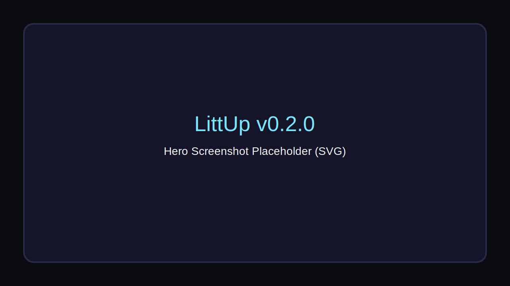
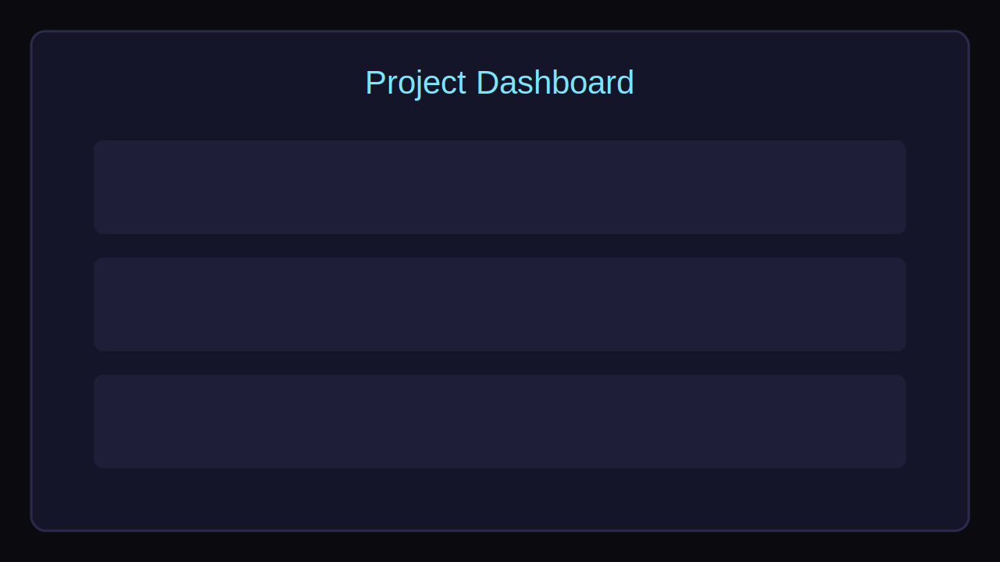
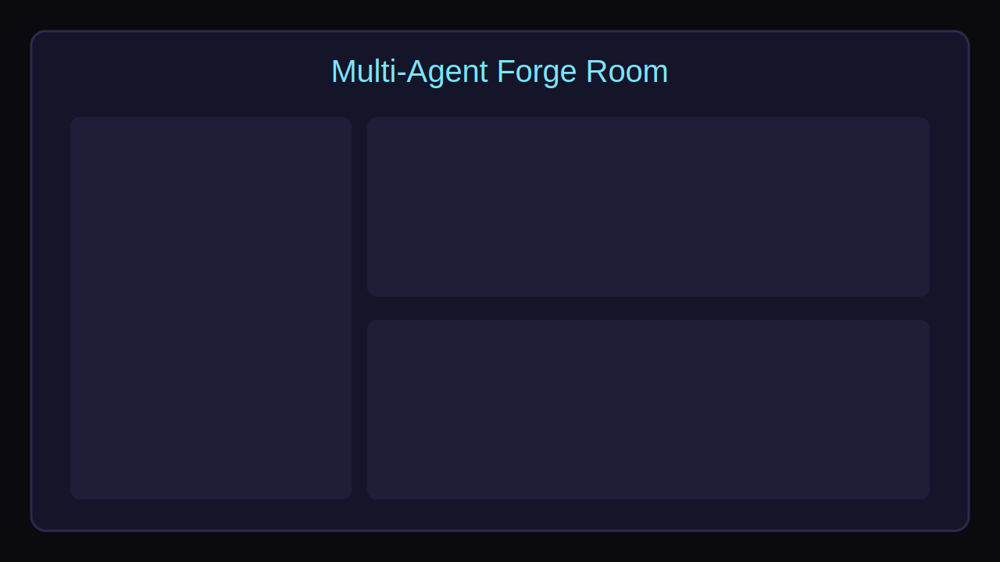

# LittUp v0.1 — The Local AI Code Forge

> Build, debug, and ship software locally with a coordinated multi-agent team.



LittUp is an all-in-one open-source studio in the Triad369 ecosystem. It is local-first, offline-capable, and private by default. The app combines:

- **Streamlit** for the primary beautiful noir interface
- **FastAPI** embedded backend for local APIs
- **SQLite** for project memory, snapshots, and chat logs
- **Local execution sandbox** for run/test loops

## Core Features

### 1) Project Dashboard
- Browse active projects with status, last modification time, and assigned team.
- One-click project creation with templates:
  - Web App
  - Python Script
  - Game

### 2) Multi-Agent Forge Room
- Assign agents to core roles:
  - Planner
  - Coder
  - Tester
  - Reviewer
  - Documenter
- Real-time collaboration chat among roles.
- Integrated code workspace with save, run, and test actions.

### 3) Agent Roles & Tools
- Planner: breaks tasks into roadmap steps.
- Coder: implements and iterates code.
- Tester: creates and runs checks.
- Reviewer: quality pass + suggestions.
- Documenter: README/docs updates.
- Tools include:
  - local file system project access
  - local git compatibility
  - contained local command runner

### 4) History & Evolution
- Version snapshots on edits/checkpoints.
- **Evolve** button to iterate based on feedback.

## Triad369 Integrations
- **Agentora**: import/pin agents to LittUp roles.
- **Memoria**: auto-store turn-by-turn collaboration memories.
- **Launchpad**: package projects + metadata for registration/sharing.

## Project Structure

```text
LittUp/
├── app.py
├── src/littup/
│   ├── api.py
│   ├── db.py
│   ├── models.py
│   └── services.py
├── templates/
│   ├── web_app/
│   ├── python_script/
│   └── game/
├── samples/
│   └── hello_app/
└── tests/
```

## Install

```bash
git clone https://github.com/MichaelWave369/LittUp
cd LittUp
python -m venv .venv
source .venv/bin/activate
pip install -r requirements.txt
pip install -e .
```

## Run

```bash
streamlit run app.py
```

LittUp stores local state in:

- `~/.littup/littup.db`
- `~/.littup/projects/`

## API (optional direct use)

```bash
uvicorn littup.api:app --host 127.0.0.1 --port 8756 --reload
```

## Screenshots




## How it works with Agentora

1. Agentora agents are mapped into LittUp role slots (Planner/Coder/Tester/Reviewer/Documenter).
2. The Forge Room uses those role assignments to coordinate implementation chat and actions.
3. Memories from every role interaction are persisted locally in SQLite, compatible with Memoria flows.
4. Final project artifacts can be packaged for Triad369-Launchpad submission.

## Security & Local-First Notes

- No cloud dependency required for core workflows.
- All data is local SQLite and local project files.
- Sandbox runner only allows selected local commands (`python`, `pytest`, `bash`, `sh`).

## License

MIT
